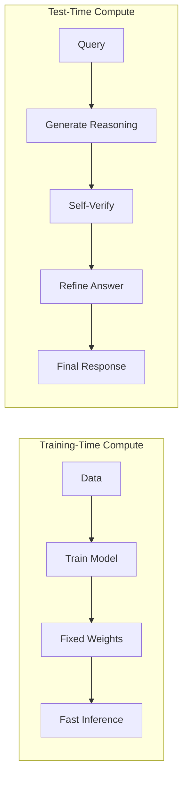

# Extended Thinking & Test-Time Compute

## The Reasoning Revolution

Traditional LLMs generate responses token-by-token in a single forward pass. But what if we gave models time to "think" before answering? This is the core insight behind **extended thinking models**—a new class of AI that uses test-time compute to reason through problems step-by-step.

<ConceptVisual
  src="/images/reasoning_models_comparison.png"
  alt="Comparison of standard LLM vs reasoning model thinking process"
  caption="Standard models rush to answers, while reasoning models think step-by-step"
/>

<Callout type="tip">
  **Key Insight**: Letting models "think longer" through extended
  chain-of-thought produces reasoning capabilities that training alone cannot
  achieve. DeepSeek-R1 proved this at scale, matching GPT-4o performance by
  generating 10-100x more tokens per query.
</Callout>

<ReasoningProcess />

## The Thinking Models Landscape (2025)

The reasoning model space has exploded in 2024-2025. Here's the complete landscape:

### OpenAI o-Series

| Model       | Release  | Key Features                                 | Best For                 |
| ----------- | -------- | -------------------------------------------- | ------------------------ |
| **o1**      | Sep 2024 | First commercial reasoning model, hidden CoT | Complex reasoning, math  |
| **o1-pro**  | Dec 2024 | Extended compute, highest accuracy           | Mission-critical tasks   |
| **o3**      | Jan 2025 | Next-gen reasoning, configurable effort      | Research, complex coding |
| **o3-mini** | Jan 2025 | Cost-efficient reasoning                     | Production workloads     |

### DeepSeek R1 Family

| Model                    | Parameters | Key Features                    | Best For                  |
| ------------------------ | ---------- | ------------------------------- | ------------------------- |
| **R1-Zero**              | 671B       | Pure RL training, no SFT        | Research baseline         |
| **R1**                   | 671B       | RL + distillation, open weights | Self-hosting, fine-tuning |
| **R1-Distill-Qwen-32B**  | 32B        | Distilled from R1               | Edge deployment           |
| **R1-Distill-Llama-70B** | 70B        | Distilled to Llama              | Llama ecosystem           |

### Other Major Players

| Model                            | Provider  | Key Features                       | Best For                    |
| -------------------------------- | --------- | ---------------------------------- | --------------------------- |
| **Claude 3.5 Extended Thinking** | Anthropic | Streaming thinking, safety-focused | Enterprise, safety-critical |
| **Gemini 2.0 Flash Thinking**    | Google    | Fast reasoning, multimodal         | Speed-sensitive reasoning   |
| **Qwen QwQ**                     | Alibaba   | Hybrid modes, 128K context         | Long-context reasoning      |
| **Grok 3 Think**                 | xAI       | Real-time data, reasoning          | Current events analysis     |

<Callout type="info">
  **Open vs Closed**: DeepSeek R1 is fully open-source (weights, training code,
  data), while OpenAI's o-series keeps reasoning traces hidden. This has major
  implications for fine-tuning and customization.
</Callout>

## What is Test-Time Compute?

**Test-time compute** refers to computational resources spent during inference (when the model generates a response) rather than during training. Instead of rushing to an answer, reasoning models:

1. **Break down complex problems** into simpler sub-tasks
2. **Work iteratively** on each step
3. **Recognize and correct mistakes** before finalizing
4. **Generate internal reasoning traces** that guide their thinking

Think of it like the difference between:

- **Traditional LLM**: "What's 347 × 89?" → Immediate answer (often wrong)
- **Reasoning Model**: "Let me break this down... 347 × 90 = 31,230, minus 347 = 30,883" → Correct answer

### Test-Time vs Training-Time Compute: A Deep Dive

Understanding the fundamental difference between these two approaches is crucial:



<ComparisonTable
  headers={["Aspect", "Training-Time Compute", "Test-Time Compute"]}
  rows={[
    [
      "When it happens",
      "Before deployment (offline)",
      "During inference (online)",
    ],
    ["Cost structure", "Fixed upfront cost", "Per-query cost"],
    ["Adaptability", "Static after training", "Adapts to query complexity"],
    ["Scaling law", "More data/params → better", "More thinking → better"],
    ["Example", "GPT-4 training: $100M+", "o3 query: $0.50-$50"],
  ]}
/>

### The Compute-Quality Tradeoff

Reasoning models let you trade compute for quality at inference time:

```python
# Low effort: Fast but less accurate
response_low = client.chat.completions.create(
    model="o3-mini",
    messages=[{"role": "user", "content": complex_problem}],
    reasoning_effort="low"  # ~2-5 seconds, ~1000 thinking tokens
)

# Medium effort: Balanced
response_med = client.chat.completions.create(
    model="o3-mini",
    messages=[{"role": "user", "content": complex_problem}],
    reasoning_effort="medium"  # ~10-20 seconds, ~5000 thinking tokens
)

# High effort: Maximum accuracy
response_high = client.chat.completions.create(
    model="o3-mini",
    messages=[{"role": "user", "content": complex_problem}],
    reasoning_effort="high"  # ~30-120 seconds, ~20000+ thinking tokens
)
```

<Callout type="tip">
  **Pro Tip**: The relationship between compute and quality follows a log-linear
  curve—doubling compute doesn't double quality. Use high effort only when
  accuracy is critical and the problem is genuinely complex.
</Callout>

### When Thinking Models Outperform

Test-time compute shines in specific scenarios:

| Scenario                 | Why Thinking Helps        | Improvement          |
| ------------------------ | ------------------------- | -------------------- |
| **Multi-step math**      | Can verify each step      | 40-60% accuracy gain |
| **Code with edge cases** | Considers failure modes   | 30-50% fewer bugs    |
| **Logical puzzles**      | Systematic exploration    | 50-70% accuracy gain |
| **Planning tasks**       | Evaluates alternatives    | 25-40% better plans  |
| **Ambiguous queries**    | Considers interpretations | 20-30% more relevant |

## The Big Three: o3, DeepSeek-R1, and Qwen

### OpenAI o3

OpenAI's o-series models (o1, o3) pioneered commercial reasoning models:

```python
from openai import OpenAI

client = OpenAI()

response = client.chat.completions.create(
    model="o3-mini",
    messages=[
        {"role": "user", "content": "Solve: If x^2 + 5x + 6 = 0, what are the values of x?"}
    ],
    # o3 automatically uses extended thinking
    reasoning_effort="high"  # low, medium, high
)

# Access the reasoning trace
print("Thinking process:")
print(response.choices[0].message.reasoning_content)

print("\nFinal answer:")
print(response.choices[0].message.content)
```

**Key Features**:

- Adjustable reasoning effort (trade latency for accuracy)
- Hidden reasoning traces (not shown to user by default)
- Excels at math, coding, and logical reasoning

### DeepSeek-R1

DeepSeek-R1 is the open-source breakthrough that democratized reasoning models:

```python
from transformers import AutoTokenizer, AutoModelForCausalLM

tokenizer = AutoTokenizer.from_pretrained("deepseek-ai/DeepSeek-R1")
model = AutoModelForCausalLM.from_pretrained(
    "deepseek-ai/DeepSeek-R1",
    torch_dtype="auto",
    device_map="auto"
)

prompt = """Solve this step-by-step:
A train travels 120 km in 2 hours. If it increases speed by 20%,
how long will it take to travel 180 km?"""

inputs = tokenizer(prompt, return_tensors="pt").to(model.device)

# Generate with extended thinking
outputs = model.generate(
    **inputs,
    max_new_tokens=2000,  # Allow space for reasoning
    temperature=0.7,
    do_sample=True
)

response = tokenizer.decode(outputs[0], skip_special_tokens=True)
print(response)
```

**Key Features**:

- Fully open-source (weights, training code, data)
- Generates 10-100x more tokens per query than standard models
- Matches o1 performance on many benchmarks
- Trained with reinforcement learning from execution feedback

### Qwen3 Thinking Mode

Qwen3 introduces **Hybrid Thinking Modes**—seamlessly switching between thinking and non-thinking:

```python
from transformers import AutoModelForCausalLM, AutoTokenizer

model = AutoModelForCausalLM.from_pretrained(
    "Qwen/Qwen3-30B-A3B-Thinking",
    torch_dtype="auto",
    device_map="auto"
)
tokenizer = AutoTokenizer.from_pretrained("Qwen/Qwen3-30B-A3B-Thinking")

# Simple query - uses non-thinking mode
simple_prompt = "What is the capital of France?"
simple_response = model.generate(tokenizer(simple_prompt, return_tensors="pt"))

# Complex query - automatically switches to thinking mode
complex_prompt = """Design a database schema for a multi-tenant SaaS application
with user authentication, billing, and audit logging."""

complex_response = model.generate(
    tokenizer(complex_prompt, return_tensors="pt"),
    max_new_tokens=3000
)
```

**Key Features**:

- Automatic mode switching based on query complexity
- Efficient: doesn't waste compute on simple queries
- 480B parameter MoE architecture (35B active)
- Excellent for long-context reasoning (128K tokens)

## When to Use Reasoning Models

<ComparisonTable
  headers={["Use Case", "Standard LLM", "Reasoning Model"]}
  rows={[
    ["Simple factual queries", "✅ Fast & cheap", "❌ Overkill"],
    ["Math problems", "❌ Often incorrect", "✅ Step-by-step accuracy"],
    ["Code generation", "⚠️ Works for simple code", "✅ Complex algorithms"],
    ["Logical puzzles", "❌ Struggles", "✅ Excels"],
    ["Creative writing", "✅ Natural & fast", "⚠️ Overthinks"],
    ["Multi-step planning", "⚠️ Loses track", "✅ Maintains coherence"],
  ]}
/>

<ReasoningModelComparison />

## Comprehensive Model Comparison (2025)

### Capabilities Matrix

<ComparisonTable
  headers={["Model", "Math", "Coding", "Logic", "Creative", "Speed", "Cost"]}
  rows={[
    [
      "o3 (high)",
      "⭐⭐⭐⭐⭐",
      "⭐⭐⭐⭐⭐",
      "⭐⭐⭐⭐⭐",
      "⭐⭐⭐",
      "⭐",
      "$$$$",
    ],
    ["o3-mini", "⭐⭐⭐⭐", "⭐⭐⭐⭐", "⭐⭐⭐⭐", "⭐⭐⭐", "⭐⭐⭐", "$$"],
    [
      "DeepSeek R1",
      "⭐⭐⭐⭐⭐",
      "⭐⭐⭐⭐",
      "⭐⭐⭐⭐",
      "⭐⭐⭐",
      "⭐⭐",
      "$",
    ],
    [
      "Claude Extended",
      "⭐⭐⭐⭐",
      "⭐⭐⭐⭐⭐",
      "⭐⭐⭐⭐",
      "⭐⭐⭐⭐",
      "⭐⭐",
      "$$$",
    ],
    [
      "Gemini Flash Think",
      "⭐⭐⭐⭐",
      "⭐⭐⭐⭐",
      "⭐⭐⭐⭐",
      "⭐⭐⭐",
      "⭐⭐⭐⭐",
      "$$",
    ],
    ["Qwen QwQ", "⭐⭐⭐⭐", "⭐⭐⭐⭐", "⭐⭐⭐⭐", "⭐⭐⭐", "⭐⭐⭐", "$"],
    [
      "GPT-4o (baseline)",
      "⭐⭐⭐",
      "⭐⭐⭐⭐",
      "⭐⭐⭐",
      "⭐⭐⭐⭐⭐",
      "⭐⭐⭐⭐⭐",
      "$",
    ],
  ]}
/>

### Detailed Pricing Comparison (as of Q1 2025)

| Model                  | Input (per 1M tokens) | Output (per 1M tokens) | Thinking Tokens | Avg Query Cost |
| ---------------------- | --------------------- | ---------------------- | --------------- | -------------- |
| **o3**                 | $10.00                | $40.00                 | Hidden (billed) | $0.50-$5.00    |
| **o3-mini**            | $1.10                 | $4.40                  | Hidden (billed) | $0.05-$0.50    |
| **o1**                 | $15.00                | $60.00                 | Hidden (billed) | $0.75-$7.50    |
| **DeepSeek R1**        | $0.55                 | $2.19                  | Visible         | $0.02-$0.20    |
| **Claude Extended**    | $3.00                 | $15.00                 | Visible         | $0.15-$1.50    |
| **Gemini Flash Think** | $0.075                | $0.30                  | Visible         | $0.01-$0.10    |
| **GPT-4o**             | $2.50                 | $10.00                 | N/A             | $0.01-$0.05    |

<Callout type="warning">
  **Hidden Thinking Costs**: OpenAI's o-series bills for thinking tokens but
  doesn't show them. A "simple" query might generate 10,000+ hidden thinking
  tokens, making costs unpredictable. DeepSeek and Claude show thinking tokens,
  enabling better cost control.
</Callout>

### Latency Characteristics

```python
# Typical latency profiles for a complex reasoning task
latency_profiles = {
    "gpt-4o": {
        "time_to_first_token": 0.3,  # seconds
        "total_response_time": 2.0,
        "tokens_generated": 500
    },
    "o3-mini-low": {
        "time_to_first_token": 3.0,
        "total_response_time": 8.0,
        "tokens_generated": 2000  # includes thinking
    },
    "o3-mini-high": {
        "time_to_first_token": 15.0,
        "total_response_time": 45.0,
        "tokens_generated": 15000  # includes thinking
    },
    "deepseek-r1": {
        "time_to_first_token": 5.0,
        "total_response_time": 25.0,
        "tokens_generated": 12000  # visible thinking
    }
}
```

## Cost-Benefit Analysis

### When Thinking Models Are Worth the Cost

<ComparisonTable
  headers={[
    "Scenario",
    "Fast Model ROI",
    "Thinking Model ROI",
    "Recommendation",
  ]}
  rows={[
    [
      "Customer support chat",
      "High (speed matters)",
      "Low (overkill)",
      "Use GPT-4o-mini",
    ],
    ["Code review automation", "Medium", "High (catches bugs)", "Use o3-mini"],
    ["Financial analysis", "Low (errors costly)", "Very High", "Use o3 or R1"],
    ["Content generation", "High", "Low (overthinks)", "Use Claude/GPT-4o"],
    ["Legal document review", "Low", "Very High", "Use o3 high effort"],
    ["Math tutoring", "Low", "Very High", "Use R1 or o3"],
  ]}
/>

### ROI Calculation Framework

```python
def calculate_reasoning_roi(
    task_value: float,           # Value of correct answer ($)
    error_cost: float,           # Cost of wrong answer ($)
    fast_model_accuracy: float,  # e.g., 0.75
    thinking_model_accuracy: float,  # e.g., 0.95
    fast_model_cost: float,      # Cost per query ($)
    thinking_model_cost: float,  # Cost per query ($)
    queries_per_month: int
) -> dict:
    """Calculate ROI of using thinking models vs fast models"""

    # Expected value with fast model
    fast_ev = (fast_model_accuracy * task_value) - \
              ((1 - fast_model_accuracy) * error_cost) - \
              fast_model_cost

    # Expected value with thinking model
    thinking_ev = (thinking_model_accuracy * task_value) - \
                  ((1 - thinking_model_accuracy) * error_cost) - \
                  thinking_model_cost

    # Monthly comparison
    fast_monthly = fast_ev * queries_per_month
    thinking_monthly = thinking_ev * queries_per_month

    return {
        "fast_model_monthly_value": fast_monthly,
        "thinking_model_monthly_value": thinking_monthly,
        "monthly_benefit": thinking_monthly - fast_monthly,
        "recommendation": "thinking" if thinking_monthly > fast_monthly else "fast",
        "breakeven_error_cost": (thinking_model_cost - fast_model_cost) / \
                                (thinking_model_accuracy - fast_model_accuracy)
    }

# Example: Code review task
roi = calculate_reasoning_roi(
    task_value=50,           # Value of good code review
    error_cost=500,          # Cost of missed bug in production
    fast_model_accuracy=0.70,
    thinking_model_accuracy=0.92,
    fast_model_cost=0.02,
    thinking_model_cost=0.25,
    queries_per_month=1000
)

print(f"Monthly benefit of thinking model: ${roi['monthly_benefit']:.2f}")
# Output: Monthly benefit of thinking model: $10,770.00
```

### Hybrid Routing Strategy

The most cost-effective approach routes queries to appropriate models:

```python
from enum import Enum
from dataclasses import dataclass

class ModelTier(Enum):
    FAST = "gpt-4o-mini"
    STANDARD = "gpt-4o"
    REASONING_LIGHT = "o3-mini"
    REASONING_HEAVY = "o3"

@dataclass
class QueryClassification:
    tier: ModelTier
    reasoning_effort: str = "medium"
    confidence: float = 0.0

def classify_query(query: str, context: dict = None) -> QueryClassification:
    """Route queries to appropriate model tier"""

    query_lower = query.lower()

    # High-stakes indicators
    high_stakes_keywords = ["financial", "legal", "medical", "security", "audit"]
    if any(kw in query_lower for kw in high_stakes_keywords):
        return QueryClassification(
            tier=ModelTier.REASONING_HEAVY,
            reasoning_effort="high",
            confidence=0.9
        )

    # Complex reasoning indicators
    reasoning_keywords = ["prove", "derive", "algorithm", "optimize", "analyze step"]
    if any(kw in query_lower for kw in reasoning_keywords):
        return QueryClassification(
            tier=ModelTier.REASONING_LIGHT,
            reasoning_effort="medium",
            confidence=0.85
        )

    # Math/logic indicators
    math_patterns = ["solve", "calculate", "equation", "probability"]
    if any(kw in query_lower for kw in math_patterns):
        return QueryClassification(
            tier=ModelTier.REASONING_LIGHT,
            reasoning_effort="low",
            confidence=0.8
        )

    # Simple queries
    simple_indicators = ["what is", "who is", "when did", "list", "summarize"]
    if any(kw in query_lower for kw in simple_indicators):
        return QueryClassification(
            tier=ModelTier.FAST,
            confidence=0.9
        )

    # Default to standard
    return QueryClassification(
        tier=ModelTier.STANDARD,
        confidence=0.6
    )

class HybridRouter:
    """Route queries to optimal model based on complexity and stakes"""

    def __init__(self):
        self.clients = {
            ModelTier.FAST: OpenAI(),
            ModelTier.STANDARD: OpenAI(),
            ModelTier.REASONING_LIGHT: OpenAI(),
            ModelTier.REASONING_HEAVY: OpenAI(),
        }
        self.stats = {"fast": 0, "standard": 0, "reasoning": 0}

    async def route(self, query: str, context: dict = None) -> str:
        classification = classify_query(query, context)

        # Track routing decisions
        if classification.tier == ModelTier.FAST:
            self.stats["fast"] += 1
        elif classification.tier == ModelTier.STANDARD:
            self.stats["standard"] += 1
        else:
            self.stats["reasoning"] += 1

        # Make API call with appropriate parameters
        params = {
            "model": classification.tier.value,
            "messages": [{"role": "user", "content": query}]
        }

        if classification.tier in [ModelTier.REASONING_LIGHT, ModelTier.REASONING_HEAVY]:
            params["reasoning_effort"] = classification.reasoning_effort

        response = await self.clients[classification.tier].chat.completions.create(**params)
        return response.choices[0].message.content

    def get_cost_savings(self) -> dict:
        """Estimate cost savings from hybrid routing"""
        # Approximate costs per query
        costs = {"fast": 0.001, "standard": 0.02, "reasoning": 0.15}

        actual_cost = sum(self.stats[k] * costs[k] for k in self.stats)
        all_reasoning_cost = sum(self.stats.values()) * costs["reasoning"]

        return {
            "actual_cost": actual_cost,
            "if_all_reasoning": all_reasoning_cost,
            "savings": all_reasoning_cost - actual_cost,
            "savings_percent": (1 - actual_cost / all_reasoning_cost) * 100
        }
```

<Callout type="success">
  **Real-World Savings**: Companies using hybrid routing typically see 60-80%
  cost reduction compared to using reasoning models for everything, while
  maintaining 95%+ of the accuracy benefits on complex queries.
</Callout>

## Practical Usage Patterns

### Prompting Thinking Models Effectively

Thinking models respond differently to prompts than standard models:

````python
# ❌ Bad: Vague prompt that wastes thinking tokens
bad_prompt = "Help me with my code"

# ✅ Good: Specific problem with clear success criteria
good_prompt = """
Debug this Python function that should return the longest palindromic substring.
Current behavior: Returns incorrect results for "babad" (returns "b" instead of "bab")

```python
def longest_palindrome(s: str) -> str:
    if not s:
        return ""
    longest = s[0]
    for i in range(len(s)):
        for j in range(i + 1, len(s)):
            if s[i:j] == s[i:j][::-1] and len(s[i:j]) > len(longest):
                longest = s[i:j]
    return longest
````

Find the bug and provide the corrected code.
"""

# ✅ Even better: Guide the reasoning process

guided_prompt = """
Debug this palindrome function. Please:

1. First, trace through the algorithm with input "babad"
2. Identify where the logic fails
3. Explain the fix
4. Provide corrected code
5. Verify with test cases

[code here]
"""

````

### Streaming Thinking Tokens

Some providers let you stream thinking tokens for better UX:

```python
import anthropic

client = anthropic.Anthropic()

# Stream thinking tokens with Claude
with client.messages.stream(
    model="claude-3-5-sonnet-20241022",
    max_tokens=16000,
    thinking={
        "type": "enabled",
        "budget_tokens": 10000  # Max thinking tokens
    },
    messages=[{"role": "user", "content": complex_problem}]
) as stream:
    print("Thinking: ", end="", flush=True)

    for event in stream:
        if event.type == "content_block_delta":
            if hasattr(event.delta, "thinking"):
                # Show thinking in real-time
                print(event.delta.thinking, end="", flush=True)
            elif hasattr(event.delta, "text"):
                # Final answer
                print(f"\n\nAnswer: {event.delta.text}", end="", flush=True)
````

### Handling Long Reasoning Chains

For complex problems, reasoning can exceed context limits:

```python
def chunked_reasoning(problem: str, max_steps: int = 5) -> str:
    """Break complex reasoning into manageable chunks"""

    steps = []
    current_context = problem

    for step in range(max_steps):
        # Ask for one reasoning step at a time
        step_prompt = f"""
        Problem context:
        {current_context}

        Previous steps:
        {chr(10).join(f"{i+1}. {s}" for i, s in enumerate(steps))}

        Provide the next logical step in solving this problem.
        If the problem is solved, respond with "SOLUTION: [answer]"
        """

        response = client.chat.completions.create(
            model="o3-mini",
            messages=[{"role": "user", "content": step_prompt}],
            reasoning_effort="low"  # Each step is simpler
        )

        step_result = response.choices[0].message.content

        if step_result.startswith("SOLUTION:"):
            return step_result.replace("SOLUTION:", "").strip()

        steps.append(step_result)
        current_context = f"{problem}\n\nProgress: {step_result}"

    # Synthesize if no solution found
    return synthesize_steps(problem, steps)
```

### Integrating with Agent Loops

Reasoning models work exceptionally well in ReAct-style agent loops:

```python
from typing import Literal

class ReasoningAgent:
    """Agent that uses thinking models for complex decisions"""

    def __init__(self):
        self.fast_model = "gpt-4o-mini"
        self.reasoning_model = "o3-mini"
        self.tools = self._load_tools()

    def _should_reason(self, task: str, history: list) -> bool:
        """Decide if current step needs deep reasoning"""

        # Use reasoning for planning
        if len(history) == 0:
            return True

        # Use reasoning after tool failures
        if history and history[-1].get("status") == "error":
            return True

        # Use reasoning for synthesis
        if len(history) >= 3:
            return True

        return False

    async def step(self, task: str, history: list) -> dict:
        """Execute one agent step"""

        if self._should_reason(task, history):
            # Use reasoning model for complex decisions
            response = await self._reasoning_step(task, history)
        else:
            # Use fast model for simple tool calls
            response = await self._fast_step(task, history)

        return response

    async def _reasoning_step(self, task: str, history: list) -> dict:
        """Deep reasoning step"""

        prompt = f"""
        Task: {task}

        History:
        {self._format_history(history)}

        Available tools: {list(self.tools.keys())}

        Think carefully about:
        1. What has been tried and what worked/failed
        2. What information is still needed
        3. The most efficient next action

        Respond with your reasoning and chosen action.
        """

        response = await client.chat.completions.create(
            model=self.reasoning_model,
            messages=[{"role": "user", "content": prompt}],
            reasoning_effort="medium"
        )

        return self._parse_action(response.choices[0].message.content)
```

<ConceptVisual
  src="/images/test_time_compute_tradeoffs.png"
  alt="Trade-offs between latency, cost, and accuracy in reasoning models"
  caption="Reasoning models trade speed and cost for significantly improved accuracy"
/>

## The Cost-Latency Trade-off

Reasoning models are powerful but come with trade-offs:

```python
import time
from openai import OpenAI

client = OpenAI()

def compare_models(prompt):
    # Standard model
    start = time.time()
    standard = client.chat.completions.create(
        model="gpt-4o",
        messages=[{"role": "user", "content": prompt}]
    )
    standard_time = time.time() - start
    standard_tokens = standard.usage.total_tokens

    # Reasoning model
    start = time.time()
    reasoning = client.chat.completions.create(
        model="o3-mini",
        messages=[{"role": "user", "content": prompt}],
        reasoning_effort="medium"
    )
    reasoning_time = time.time() - start
    reasoning_tokens = reasoning.usage.total_tokens

    print(f"Standard: {standard_time:.2f}s, {standard_tokens} tokens")
    print(f"Reasoning: {reasoning_time:.2f}s, {reasoning_tokens} tokens")
    print(f"Slowdown: {reasoning_time/standard_time:.1f}x")
    print(f"Token increase: {reasoning_tokens/standard_tokens:.1f}x")

compare_models("Solve: 3x + 7 = 22")
```

**Typical Results**:

- **Latency**: 3-10x slower
- **Token usage**: 10-100x more tokens
- **Cost**: Significantly higher per query
- **Accuracy**: 20-50% improvement on reasoning tasks

## Building Agents with Reasoning Models

Reasoning models shine in agentic workflows where accuracy matters more than speed:

```python
from langgraph.graph import StateGraph, END
from langchain_openai import ChatOpenAI

# Define agent state
class AgentState(TypedDict):
    problem: str
    reasoning_trace: str
    solution: str
    verification: str

# Create reasoning model
reasoning_model = ChatOpenAI(model="o3-mini", reasoning_effort="high")

def reason_node(state: AgentState):
    """Use reasoning model to solve problem"""
    response = reasoning_model.invoke([
        {"role": "user", "content": state["problem"]}
    ])

    return {
        "reasoning_trace": response.reasoning_content,
        "solution": response.content
    }

def verify_node(state: AgentState):
    """Verify the solution"""
    verification_prompt = f"""
    Problem: {state['problem']}
    Proposed solution: {state['solution']}

    Verify this solution step-by-step. Is it correct?
    """

    verification = reasoning_model.invoke([
        {"role": "user", "content": verification_prompt}
    ])

    return {"verification": verification.content}

# Build graph
workflow = StateGraph(AgentState)
workflow.add_node("reason", reason_node)
workflow.add_node("verify", verify_node)

workflow.set_entry_point("reason")
workflow.add_edge("reason", "verify")
workflow.add_edge("verify", END)

app = workflow.compile()

# Run
result = app.invoke({
    "problem": "Design an algorithm to find the longest palindromic substring in O(n) time"
})

print("Reasoning:", result["reasoning_trace"])
print("Solution:", result["solution"])
print("Verification:", result["verification"])
```

## Optimizing Reasoning Effort

Not all problems need maximum thinking time. Implement dynamic reasoning effort:

```python
def classify_complexity(query: str) -> str:
    """Classify query complexity to determine reasoning effort"""

    # Simple heuristics
    if len(query.split()) < 20:
        return "low"

    complex_keywords = ["design", "algorithm", "prove", "optimize", "analyze"]
    if any(kw in query.lower() for kw in complex_keywords):
        return "high"

    return "medium"

def adaptive_reasoning(query: str):
    """Use appropriate reasoning effort based on query"""
    effort = classify_complexity(query)

    response = client.chat.completions.create(
        model="o3-mini",
        messages=[{"role": "user", "content": query}],
        reasoning_effort=effort
    )

    return response

# Examples
print(adaptive_reasoning("What is 2+2?"))  # Uses low effort
print(adaptive_reasoning("Design a distributed consensus algorithm"))  # Uses high effort
```

## Parallel Reasoning with ThreadWeaver

For ultra-low latency, parallelize the reasoning process:

```python
import asyncio
from typing import List

async def parallel_reasoning_step(step: str, context: str):
    """Execute one reasoning step in parallel"""
    response = await client.chat.completions.create(
        model="o3-mini",
        messages=[
            {"role": "system", "content": context},
            {"role": "user", "content": step}
        ],
        reasoning_effort="low"  # Each step is simpler
    )
    return response.choices[0].message.content

async def threadweaver_reasoning(problem: str, steps: List[str]):
    """Parallelize reasoning across multiple steps"""

    # Execute all steps in parallel
    results = await asyncio.gather(*[
        parallel_reasoning_step(step, problem)
        for step in steps
    ])

    # Synthesize results
    synthesis_prompt = f"""
    Problem: {problem}

    Partial solutions:
    {chr(10).join(f"{i+1}. {r}" for i, r in enumerate(results))}

    Synthesize these into a final solution.
    """

    final = await client.chat.completions.create(
        model="o3-mini",
        messages=[{"role": "user", "content": synthesis_prompt}],
        reasoning_effort="medium"
    )

    return final.choices[0].message.content

# Example: Break complex problem into parallel steps
problem = "Design a scalable microservices architecture for an e-commerce platform"
steps = [
    "Design the authentication service",
    "Design the product catalog service",
    "Design the order processing service",
    "Design the payment service"
]

solution = asyncio.run(threadweaver_reasoning(problem, steps))
```

## Advanced Reasoning Patterns

### Self-Consistency Sampling

Run multiple reasoning paths and vote on the answer:

```python
import asyncio
from collections import Counter

async def self_consistency_reasoning(
    problem: str,
    num_samples: int = 5,
    temperature: float = 0.7
) -> dict:
    """Generate multiple reasoning paths and find consensus"""

    async def single_sample():
        response = await client.chat.completions.create(
            model="o3-mini",
            messages=[{"role": "user", "content": problem}],
            reasoning_effort="low",
            temperature=temperature
        )
        return {
            "reasoning": response.choices[0].message.reasoning_content,
            "answer": response.choices[0].message.content
        }

    # Generate samples in parallel
    samples = await asyncio.gather(*[single_sample() for _ in range(num_samples)])

    # Extract and normalize answers
    answers = [s["answer"].strip().lower() for s in samples]

    # Vote on most common answer
    vote_counts = Counter(answers)
    best_answer, count = vote_counts.most_common(1)[0]

    # Find the best reasoning for the winning answer
    best_reasoning = next(
        s["reasoning"] for s in samples
        if s["answer"].strip().lower() == best_answer
    )

    return {
        "answer": best_answer,
        "confidence": count / num_samples,
        "reasoning": best_reasoning,
        "all_answers": dict(vote_counts)
    }

# Example usage
result = asyncio.run(self_consistency_reasoning(
    "What is the probability of getting exactly 3 heads in 5 coin flips?",
    num_samples=5
))
print(f"Answer: {result['answer']} (confidence: {result['confidence']:.0%})")
```

### Reasoning with Verification Loops

Implement self-verification for higher accuracy:

```python
class VerifiedReasoner:
    """Reasoning with automatic verification and retry"""

    def __init__(self, max_retries: int = 3):
        self.max_retries = max_retries
        self.client = OpenAI()

    async def solve(self, problem: str) -> dict:
        """Solve with verification loop"""

        for attempt in range(self.max_retries):
            # Generate solution
            solution = await self._generate_solution(problem, attempt)

            # Verify solution
            verification = await self._verify_solution(problem, solution)

            if verification["is_correct"]:
                return {
                    "solution": solution,
                    "verification": verification,
                    "attempts": attempt + 1
                }

            # If wrong, include feedback in next attempt
            problem = f"""
            {problem}

            Previous attempt was incorrect:
            {solution}

            Verification feedback:
            {verification['feedback']}

            Please try again, addressing the issues identified.
            """

        return {
            "solution": solution,
            "verification": verification,
            "attempts": self.max_retries,
            "warning": "Max retries reached, solution may be incorrect"
        }

    async def _generate_solution(self, problem: str, attempt: int) -> str:
        effort = ["low", "medium", "high"][min(attempt, 2)]

        response = await self.client.chat.completions.create(
            model="o3-mini",
            messages=[{"role": "user", "content": problem}],
            reasoning_effort=effort
        )
        return response.choices[0].message.content

    async def _verify_solution(self, problem: str, solution: str) -> dict:
        verification_prompt = f"""
        Problem: {problem}

        Proposed solution: {solution}

        Verify this solution step-by-step:
        1. Check if the approach is correct
        2. Verify any calculations
        3. Check edge cases
        4. Confirm the final answer

        Respond with JSON:
        {{
            "is_correct": true/false,
            "confidence": 0.0-1.0,
            "feedback": "explanation of any issues"
        }}
        """

        response = await self.client.chat.completions.create(
            model="o3-mini",
            messages=[{"role": "user", "content": verification_prompt}],
            reasoning_effort="medium",
            response_format={"type": "json_object"}
        )

        return json.loads(response.choices[0].message.content)
```

### Debate-Style Reasoning

Use multiple models to debate and refine answers:

```python
async def debate_reasoning(problem: str, rounds: int = 2) -> dict:
    """Two reasoning instances debate to find the best answer"""

    # Initial solutions from two "debaters"
    debater_a = await generate_solution(problem, "You are Debater A. Solve this problem.")
    debater_b = await generate_solution(problem, "You are Debater B. Solve this problem independently.")

    for round in range(rounds):
        # A critiques B
        critique_a = await generate_critique(problem, debater_b["solution"], "A")

        # B critiques A
        critique_b = await generate_critique(problem, debater_a["solution"], "B")

        # Both refine based on critiques
        debater_a = await refine_solution(problem, debater_a, critique_b)
        debater_b = await refine_solution(problem, debater_b, critique_a)

    # Judge picks the winner
    judgment = await judge_solutions(problem, debater_a, debater_b)

    return {
        "winner": judgment["winner"],
        "solution": judgment["best_solution"],
        "reasoning": judgment["explanation"],
        "debate_history": {
            "debater_a": debater_a,
            "debater_b": debater_b
        }
    }
```

## Best Practices

### 1. Use Reasoning Models Selectively

```python
def should_use_reasoning(query: str, context: dict) -> bool:
    """Decide if reasoning model is worth the cost"""

    # High-stakes decisions
    if context.get("financial_impact", 0) > 10000:
        return True

    # Complex technical problems
    if any(kw in query.lower() for kw in ["algorithm", "proof", "optimization"]):
        return True

    # Multi-step planning
    if "step" in query.lower() or "plan" in query.lower():
        return True

    return False
```

### 2. Cache Reasoning Traces

```python
from functools import lru_cache
import hashlib

@lru_cache(maxsize=1000)
def cached_reasoning(query_hash: str, query: str):
    """Cache expensive reasoning results"""
    response = client.chat.completions.create(
        model="o3-mini",
        messages=[{"role": "user", "content": query}],
        reasoning_effort="high"
    )
    return response

def reason_with_cache(query: str):
    query_hash = hashlib.md5(query.encode()).hexdigest()
    return cached_reasoning(query_hash, query)
```

### 3. Monitor Reasoning Quality

```python
def evaluate_reasoning(problem: str, solution: str, reasoning_trace: str) -> dict:
    """Evaluate the quality of reasoning"""

    metrics = {
        "reasoning_length": len(reasoning_trace.split()),
        "solution_length": len(solution.split()),
        "steps_taken": reasoning_trace.count("\n\n"),
        "corrections_made": reasoning_trace.lower().count("wait") +
                          reasoning_trace.lower().count("actually"),
    }

    # Verify solution
    verification_prompt = f"""
    Problem: {problem}
    Solution: {solution}

    Rate this solution on a scale of 1-10 for:
    1. Correctness
    2. Completeness
    3. Clarity

    Return JSON: {{"correctness": X, "completeness": Y, "clarity": Z}}
    """

    eval_response = client.chat.completions.create(
        model="gpt-4o",
        messages=[{"role": "user", "content": verification_prompt}],
        response_format={"type": "json_object"}
    )

    metrics.update(json.loads(eval_response.choices[0].message.content))
    return metrics
```

## Exercise: Build a Reasoning Agent

<Exercise
  title="Mathematical Reasoning Agent"
  difficulty="intermediate"
  timeEstimate="45 minutes"
>

Build an agent that solves complex math problems using extended thinking:

**Requirements**:

1. Accept a math problem as input
2. Use a reasoning model to solve it step-by-step
3. Verify the solution with a second reasoning pass
4. If verification fails, retry with higher reasoning effort
5. Log reasoning traces for debugging

**Acceptance Criteria**:

- Correctly solves at least 8/10 problems from the AIME dataset
- Shows reasoning traces for each step
- Implements retry logic for failed verifications
- Tracks token usage and latency

**Extension Challenge**:

- Implement parallel reasoning for multi-part problems
- Add a "confidence score" based on reasoning trace analysis
- Cache solutions for similar problems

</Exercise>

## Key Takeaways

<Callout type="success">

**What You Learned**:

1. **Test-time compute** trades latency for accuracy by letting models "think"
2. **o3, DeepSeek-R1, and Qwen** are the leading reasoning models
3. **Use reasoning selectively** for complex problems where accuracy matters
4. **Parallel reasoning** can reduce latency while maintaining quality
5. **Monitor and cache** reasoning traces to optimize cost and performance

</Callout>

## Next Steps

In the next module, we'll explore **Agentic Context Engineering (ACE)**—a framework for building self-improving agents that learn from experience without fine-tuning.

<PageNavigation
  prev={{
    title: "Structured Output",
    href: "/modules/day-05-structured-output",
  }}
  next={{
    title: "Prompt Engineering Deep Dive",
    href: "/modules/day-07-prompt-engineering",
  }}
/>
