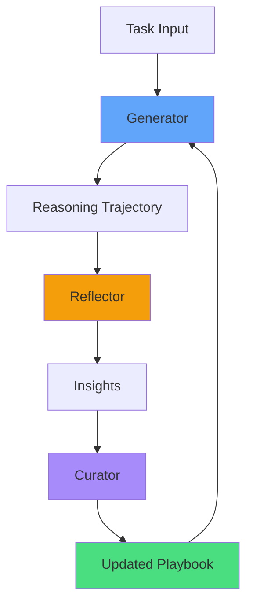

# Agentic Context Engineering (ACE)

## The Self-Improvement Problem

Traditional agents are static—they perform the same way on day 1 as day 100. But what if your agent could **learn from its mistakes** and **improve over time** without expensive fine-tuning?

This is the promise of **Agentic Context Engineering (ACE)**—a framework that enables agents to self-improve by evolving their context "playbook" based on experience.

<Callout type="insight">
  **Research Results**: ACE achieves +10.6% performance improvement on agent
  tasks and 83.6% lower token costs compared to traditional self-improving
  methods. It allows smaller open-source models to match GPT-4 performance.
</Callout>

## The Problem with Traditional Approaches

### Fine-Tuning Limitations

```python
# Traditional approach: Fine-tune the model
# ❌ Problems:
# - Expensive (requires GPU clusters)
# - Slow (days to weeks)
# - Inflexible (can't quickly update knowledge)
# - Risk of catastrophic forgetting

from transformers import Trainer, TrainingArguments

training_args = TrainingArguments(
    output_dir="./fine-tuned-model",
    num_train_epochs=3,
    per_device_train_batch_size=4,
    # Requires expensive compute
)

trainer = Trainer(
    model=model,
    args=training_args,
    train_dataset=training_data,
)

trainer.train()  # Takes hours/days
```

### Prompt Rewriting Issues

```python
# Naive self-improvement: Rewrite entire prompt
# ❌ Problems:
# - Brevity bias (prompts get shorter over time)
# - Context collapse (forgets valuable knowledge)
# - Instability (performance regresses)

def naive_self_improve(prompt, feedback):
    """Rewrite entire prompt based on feedback"""
    new_prompt = llm.invoke(f"""
    Current prompt: {prompt}
    Feedback: {feedback}

    Rewrite the prompt to address this feedback.
    """)

    return new_prompt  # Loses previous learnings!
```

## The ACE Framework

ACE solves these problems with a **structured, incremental approach** to context evolution:



<ConceptVisual
  src="/images/ace_framework_architecture.png"
  alt="ACE Framework Architecture"
  caption="The ACE Cycle: Generator -> Reflector -> Curator -> Playbook."
/>

<ACEPlaybookVisualizer />

### Core Components

1. **Generator**: Produces solutions using the current playbook
2. **Reflector**: Analyzes successes and failures, extracts insights
3. **Curator**: Integrates insights into the playbook incrementally
4. **Playbook**: Structured collection of reusable knowledge

## Building Your First ACE Agent

### Step 1: Define the Playbook Structure

```python
from typing import List, Dict
from pydantic import BaseModel
from datetime import datetime

class PlaybookEntry(BaseModel):
    """A single piece of learned knowledge"""
    id: str
    content: str
    category: str  # "strategy", "pitfall", "example"
    helpfulness_score: float = 0.0
    usage_count: int = 0
    created_at: datetime
    last_used: datetime
```

<ConceptVisual
  src="/images/ace_playbook_evolution.png"
  alt="Playbook Evolution"
  caption="From basic patterns to expert strategies: How the playbook grows."
/>

```python
class Playbook(BaseModel):
    """The agent's evolving knowledge base"""
    entries: List[PlaybookEntry] = []
    version: int = 1

    def add_entry(self, content: str, category: str):
        """Add new knowledge to playbook"""
        entry = PlaybookEntry(
            id=f"entry_{len(self.entries)}",
            content=content,
            category=category,
            created_at=datetime.now(),
            last_used=datetime.now()
        )
        self.entries.append(entry)

    def get_relevant_entries(self, task: str, top_k: int = 5) -> List[PlaybookEntry]:
        """Retrieve most relevant entries for a task"""
        # Simple relevance: keyword matching + helpfulness
        scored_entries = []
        for entry in self.entries:
            relevance = sum(
                word.lower() in entry.content.lower()
                for word in task.split()
            )
            score = relevance * (1 + entry.helpfulness_score)
            scored_entries.append((score, entry))

        scored_entries.sort(reverse=True, key=lambda x: x[0])
        return [entry for _, entry in scored_entries[:top_k]]

    def to_prompt(self, task: str) -> str:
        """Convert playbook to prompt context"""
        relevant = self.get_relevant_entries(task)

        if not relevant:
            return ""

        prompt = "## Learned Strategies\n\n"
        for entry in relevant:
            prompt += f"- **{entry.category.title()}**: {entry.content}\n"

        return prompt
```

### Step 2: Implement the Generator

```python
from langchain_openai import ChatOpenAI

class ACEGenerator:
    """Generates solutions using current playbook"""

    def __init__(self, model: str = "gpt-4o"):
        self.llm = ChatOpenAI(model=model, temperature=0.7)

    def generate(self, task: str, playbook: Playbook) -> Dict:
        """Generate solution with playbook context"""

        # Build prompt with relevant playbook entries
        playbook_context = playbook.to_prompt(task)

        prompt = f"""
{playbook_context}

## Task
{task}

## Instructions
Solve this task step-by-step. Show your reasoning.
"""

        response = self.llm.invoke(prompt)

        return {
            "task": task,
            "solution": response.content,
            "playbook_used": playbook_context
        }
```

### Step 3: Implement the Reflector

```python
class ACEReflector:
    """Analyzes performance and extracts insights"""

    def __init__(self, model: str = "gpt-4o"):
        self.llm = ChatOpenAI(model=model, temperature=0.3)

    def reflect(self, trajectory: Dict, feedback: str) -> List[str]:
        """Extract actionable insights from performance"""

        reflection_prompt = f"""
Analyze this agent's performance:

Task: {trajectory['task']}
Solution: {trajectory['solution']}
Feedback: {feedback}

Extract 2-3 specific, actionable insights that would help the agent perform better on similar tasks in the future.

Format each insight as a bullet point starting with:
- "Strategy:" for successful approaches
- "Pitfall:" for mistakes to avoid
- "Example:" for concrete examples

Be specific and concise (max 20 words per insight).
"""

        response = self.llm.invoke(reflection_prompt)

        # Parse insights
        insights = []
        for line in response.content.split('\n'):
            line = line.strip()
            if line.startswith('- '):
                insights.append(line[2:])  # Remove "- " prefix

        return insights
```

### Step 4: Implement the Curator

```python
class ACECurator:
    """Integrates insights into playbook"""

    def __init__(self, model: str = "gpt-4o"):
        self.llm = ChatOpenAI(model=model, temperature=0.1)

    def curate(self, playbook: Playbook, insights: List[str]) -> Playbook:
        """Add insights to playbook, avoiding redundancy"""

        for insight in insights:
            # Determine category
            if insight.startswith("Strategy:"):
                category = "strategy"
                content = insight.replace("Strategy:", "").strip()
            elif insight.startswith("Pitfall:"):
                category = "pitfall"
                content = insight.replace("Pitfall:", "").strip()
            elif insight.startswith("Example:"):
                category = "example"
                content = insight.replace("Example:", "").strip()
            else:
                category = "general"
                content = insight

            # Check for redundancy
            if not self._is_redundant(playbook, content):
                playbook.add_entry(content, category)

        return playbook

    def _is_redundant(self, playbook: Playbook, new_content: str) -> bool:
        """Check if insight already exists in playbook"""
        new_words = set(new_content.lower().split())

        for entry in playbook.entries:
            existing_words = set(entry.content.lower().split())
            overlap = len(new_words & existing_words) / len(new_words)

            if overlap > 0.7:  # 70% word overlap
                return True

        return False
```

### Step 5: Put It All Together

```python
class ACEAgent:
    """Self-improving agent using ACE framework"""

    def __init__(self):
        self.playbook = Playbook()
        self.generator = ACEGenerator()
        self.reflector = ACEReflector()
        self.curator = ACECurator()
        self.history = []

    def run(self, task: str, feedback: str = None) -> Dict:
        """Execute task and optionally learn from feedback"""

        # Generate solution
        trajectory = self.generator.generate(task, self.playbook)

        # If feedback provided, learn from it
        if feedback:
            insights = self.reflector.reflect(trajectory, feedback)
            self.playbook = self.curator.curate(self.playbook, insights)
            trajectory["insights_learned"] = insights

        # Track history
        self.history.append(trajectory)

        return trajectory

    def save_playbook(self, path: str):
        """Save playbook to disk"""
        with open(path, 'w') as f:
            f.write(self.playbook.model_dump_json(indent=2))

    def load_playbook(self, path: str):
        """Load playbook from disk"""
        with open(path, 'r') as f:
            data = json.load(f)
            self.playbook = Playbook(**data)
```

<ConceptVisual
  src="/images/ace_playbook_evolution.png"
  alt="Visualization of how ACE playbook grows and improves over iterations"
  caption="ACE playbooks evolve incrementally, preserving valuable knowledge while adding new insights"
/>

## Example: Code Review Agent

Let's build a self-improving code review agent:

```python
# Initialize agent
agent = ACEAgent()

# Task 1: Review code with security issue
task1 = """
Review this Python code:

def login(username, password):
    query = f"SELECT * FROM users WHERE username='{username}' AND password='{password}'"
    return db.execute(query)
"""

result1 = agent.run(task1)
print("Review:", result1["solution"])

# Provide feedback
feedback1 = """
Good catch on SQL injection! But you should also mention:
1. Passwords should be hashed, not stored in plaintext
2. Use parameterized queries, not just mention them
3. Suggest specific libraries (e.g., bcrypt, SQLAlchemy)
"""

agent.run(task1, feedback=feedback1)

# Task 2: Similar code review
task2 = """
Review this Python code:

def authenticate(email, pwd):
    sql = f"SELECT * FROM accounts WHERE email='{email}' AND pwd='{pwd}'"
    return database.query(sql)
"""

result2 = agent.run(task2)
print("Review:", result2["solution"])

# Now includes learned strategies about hashing and parameterized queries!

# View learned playbook
print("\n=== Learned Playbook ===")
for entry in agent.playbook.entries:
    print(f"[{entry.category}] {entry.content}")
```

**Output After Learning**:

```
=== Learned Playbook ===
[pitfall] Never use string formatting for SQL queries - leads to SQL injection
[strategy] Always use parameterized queries with libraries like SQLAlchemy
[strategy] Hash passwords with bcrypt before storing, never plaintext
[example] Use cursor.execute("SELECT * FROM users WHERE id=?", (user_id,))
```

## Advanced: Grow-and-Refine Phase

Periodically clean up the playbook to prevent bloat:

```python
class ACECurator:
    # ... previous methods ...

    def grow_and_refine(self, playbook: Playbook, max_entries: int = 50) -> Playbook:
        """Consolidate and prune playbook entries"""

        if len(playbook.entries) <= max_entries:
            return playbook

        # Remove low-value entries
        playbook.entries.sort(
            key=lambda e: e.helpfulness_score * e.usage_count,
            reverse=True
        )
        playbook.entries = playbook.entries[:max_entries]

        # Merge similar entries
        merged = []
        skip_indices = set()

        for i, entry1 in enumerate(playbook.entries):
            if i in skip_indices:
                continue

            similar = [entry1]
            for j, entry2 in enumerate(playbook.entries[i+1:], start=i+1):
                if self._are_similar(entry1.content, entry2.content):
                    similar.append(entry2)
                    skip_indices.add(j)

            if len(similar) > 1:
                # Merge similar entries
                merged_content = self._merge_entries(similar)
                merged_entry = PlaybookEntry(
                    id=entry1.id,
                    content=merged_content,
                    category=entry1.category,
                    helpfulness_score=max(e.helpfulness_score for e in similar),
                    usage_count=sum(e.usage_count for e in similar),
                    created_at=min(e.created_at for e in similar),
                    last_used=max(e.last_used for e in similar)
                )
                merged.append(merged_entry)
            else:
                merged.append(entry1)

        playbook.entries = merged
        playbook.version += 1

        return playbook

    def _are_similar(self, content1: str, content2: str, threshold: float = 0.6) -> bool:
        """Check if two entries are similar"""
        words1 = set(content1.lower().split())
        words2 = set(content2.lower().split())

        if not words1 or not words2:
            return False

        overlap = len(words1 & words2) / max(len(words1), len(words2))
        return overlap >= threshold

    def _merge_entries(self, entries: List[PlaybookEntry]) -> str:
        """Merge similar entries into one"""
        contents = [e.content for e in entries]

        merge_prompt = f"""
Merge these similar insights into one concise statement (max 25 words):

{chr(10).join(f"- {c}" for c in contents)}

Return only the merged insight, no explanation.
"""

        response = self.llm.invoke(merge_prompt)
        return response.content.strip()
```

## Tracking Helpfulness

Update entry scores based on task success:

```python
class ACEAgent:
    # ... previous methods ...

    def run_with_evaluation(self, task: str, expected_output: str = None) -> Dict:
        """Run task and evaluate performance"""

        # Track which entries were used
        relevant_entries = self.playbook.get_relevant_entries(task)
        entry_ids = [e.id for e in relevant_entries]

        # Generate solution
        trajectory = self.generator.generate(task, self.playbook)

        # Evaluate if expected output provided
        if expected_output:
            success = self._evaluate_success(
                trajectory["solution"],
                expected_output
            )

            # Update helpfulness scores
            delta = 0.1 if success else -0.05
            for entry in self.playbook.entries:
                if entry.id in entry_ids:
                    entry.helpfulness_score += delta
                    entry.usage_count += 1
                    entry.last_used = datetime.now()

        return trajectory

    def _evaluate_success(self, solution: str, expected: str) -> bool:
        """Evaluate if solution matches expected output"""
        eval_prompt = f"""
Compare these two outputs:

Expected: {expected}
Actual: {solution}

Are they semantically equivalent? Answer only "yes" or "no".
"""

        response = self.llm.invoke(eval_prompt)
        return "yes" in response.content.lower()
```

## Real-World Example: Customer Support Agent

```python
# Initialize support agent
support_agent = ACEAgent()

# Training phase: Learn from interactions
training_cases = [
    {
        "task": "Customer says: My order hasn't arrived and it's been 2 weeks!",
        "feedback": "Good empathy, but you should: 1) Ask for order number first, 2) Check tracking immediately, 3) Offer specific compensation options"
    },
    {
        "task": "Customer says: I want to return this product, it doesn't work.",
        "feedback": "Remember to: 1) Apologize first, 2) Ask about the specific issue, 3) Mention the 30-day return policy, 4) Provide return label link"
    },
    {
        "task": "Customer says: Your website is down!",
        "feedback": "Great response! You checked status page, gave ETA, and offered alternative. Keep doing this."
    }
]

for case in training_cases:
    support_agent.run(case["task"], feedback=case["feedback"])

# Production: Agent now uses learned strategies
new_case = "Customer says: I was charged twice for my order!"

response = support_agent.run(new_case)
print(response["solution"])

# Playbook now includes:
# - Strategy: Always ask for order/transaction number first
# - Strategy: Check system immediately before responding
# - Pitfall: Don't make promises without verifying data
# - Example: "I apologize for the inconvenience. Let me check your account..."
```

## Performance Metrics

Track ACE agent improvement over time:

```python
import matplotlib.pyplot as plt

def track_performance(agent: ACEAgent, test_cases: List[Dict]):
    """Track agent performance over time"""

    results = {
        "iteration": [],
        "accuracy": [],
        "playbook_size": [],
        "avg_helpfulness": []
    }

    for i, case in enumerate(test_cases):
        result = agent.run_with_evaluation(
            case["task"],
            case["expected_output"]
        )

        # Calculate metrics
        accuracy = agent._evaluate_success(
            result["solution"],
            case["expected_output"]
        )

        results["iteration"].append(i)
        results["accuracy"].append(1 if accuracy else 0)
        results["playbook_size"].append(len(agent.playbook.entries))

        if agent.playbook.entries:
            avg_help = sum(e.helpfulness_score for e in agent.playbook.entries) / len(agent.playbook.entries)
            results["avg_helpfulness"].append(avg_help)
        else:
            results["avg_helpfulness"].append(0)

    # Plot results
    fig, axes = plt.subplots(1, 3, figsize=(15, 4))

    axes[0].plot(results["iteration"], results["accuracy"])
    axes[0].set_title("Accuracy Over Time")
    axes[0].set_xlabel("Iteration")
    axes[0].set_ylabel("Accuracy")

    axes[1].plot(results["iteration"], results["playbook_size"])
    axes[1].set_title("Playbook Growth")
    axes[1].set_xlabel("Iteration")
    axes[1].set_ylabel("# Entries")

    axes[2].plot(results["iteration"], results["avg_helpfulness"])
    axes[2].set_title("Average Entry Helpfulness")
    axes[2].set_xlabel("Iteration")
    axes[2].set_ylabel("Score")

    plt.tight_layout()
    plt.savefig("ace_performance.png")
```

## Exercise: Build a Self-Improving Agent

<Exercise
  title="ACE-Powered SQL Query Agent"
  difficulty="advanced"
  timeEstimate="90 minutes"
>

Build an agent that generates SQL queries and learns from mistakes:

**Requirements**:

1. Accept natural language queries about a database
2. Generate SQL queries using current playbook
3. Execute queries and check for errors
4. Learn from errors and successful patterns
5. Implement grow-and-refine to prevent playbook bloat

**Acceptance Criteria**:

- Starts with empty playbook
- After 20 queries, achieves >80% success rate
- Playbook contains specific SQL patterns and pitfalls
- Implements automatic error recovery

**Extension Challenge**:

- Add semantic similarity for entry retrieval (use embeddings)
- Implement A/B testing of playbook versions
- Create visualization of playbook evolution

</Exercise>

## Key Takeaways

<Callout type="success">

**What You Learned**:

1. **ACE enables self-improvement** without expensive fine-tuning
2. **Structured playbooks** prevent context collapse and brevity bias
3. **Incremental updates** preserve valuable knowledge over time
4. **Reflection and curation** extract actionable insights from experience
5. **Grow-and-refine** keeps playbooks manageable and high-quality

</Callout>

## Next Steps

In the next module, we'll explore the **Agent Skills Standard**—a protocol for packaging and sharing specialized agent capabilities across platforms.

<PageNavigation
  prev={{ title: "Loops & Control Flow", href: "/modules/day-11-loops" }}
  next={{
    title: "Agent Skills Standard",
    href: "/modules/day-13-agent-skills",
  }}
/>
